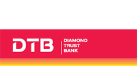
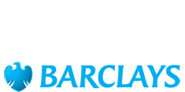

[](https://travis-ci.com/TralahM/py-equity-jenga-api)
[](https://equity-jenga-api.readthedocs.io/en/latest/?badge=latest)
[](https://opensource.org/licenses/MIT)
[](https://github.com/TralahTek)
[](http://dwyl.io/TralahM/py-equity-jenga-api)
[](https://github.com/TralahM/py-equity-jenga-api/pull/)
[](https://github.com/TralahM/py-equity-jenga-api/pull/)
[](https://github.com/TralahM)

# py-equity-jenga-api.


[](https://github.com/TralahTek)
[](https://github.com/TralahM)
[](https://github.com/TralahM)

# Documentation

[](https://equity-jenga-api.readthedocs.io)

# How to Install
```bash
# In terminal do:
pip install equity-jenga-api
```

## Building from Source for Developers

```console
$ git clone https://github.com/TralahM/py-equity-jenga-api.git
$ cd py-equity-jenga-api
```

# Supported Pesa Link Patner Banks








# Contributing
[See the Contributing File](CONTRIBUTING.rst)


[See the Pull Request File](PULL_REQUEST_TEMPLATE.md)


# Support

# LICENCE

[Read the license here](LICENSE)


# Self-Promotion

[](https://twitter.com/TralahM)
[](https://github.com/TralahM)
[](https://kaggle.com/TralahM)
[](https://linkedin.com/in/TralahM)
[](https://tralahm.tralahtek.com)
[](https://tralahtek.com)


